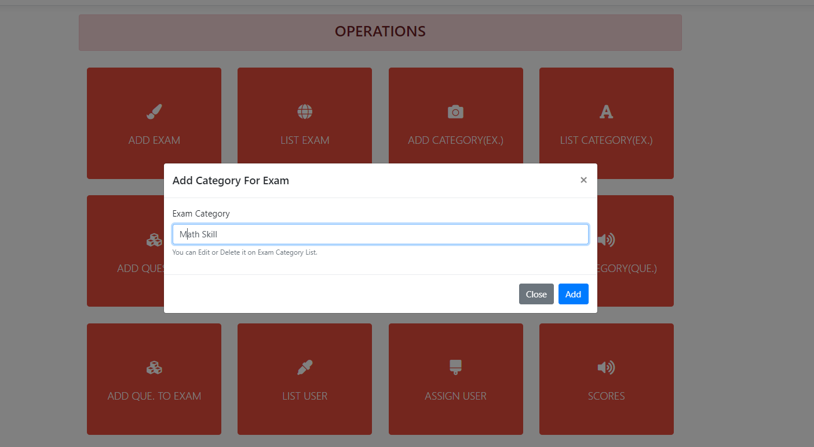
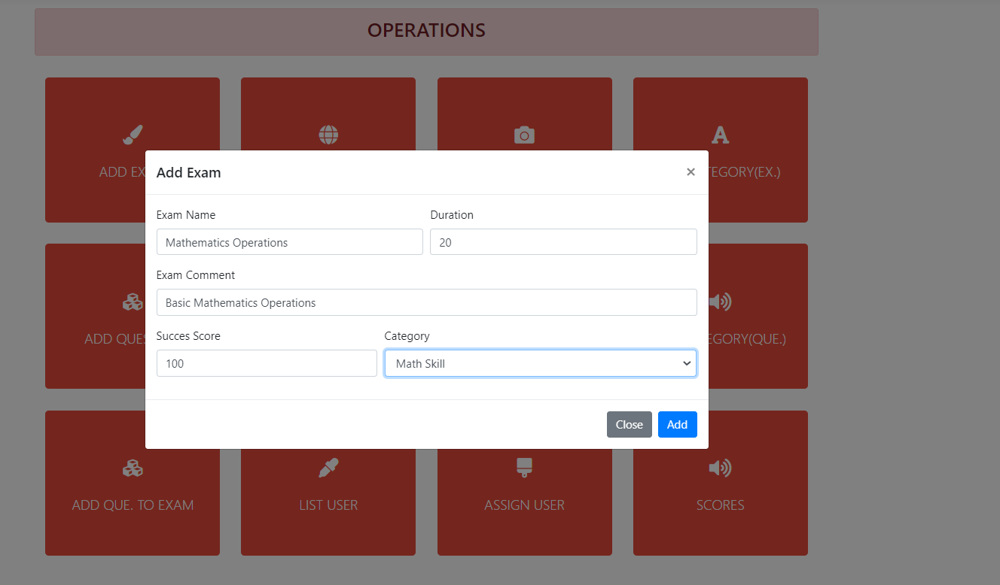

# ExampleQuizProject
Example Basic Quiz Project. Admin Creates Quiz,asssign to user  and user can take the quiz.
 
 
front:Bootstrap Modals and Datatables with AJAX(server-side), 
 
 
backend:.net core,entity framework, repository design pattern,Unit OF Work,
 
 
database;mssql
 
 

 
 

 
 

 
 

 
 

 
 

 
 

 
 

 
 

 
 

 
 

 
 

 
 

 
 

 
 

 
 

 
 

 
 

 
 

 
 

